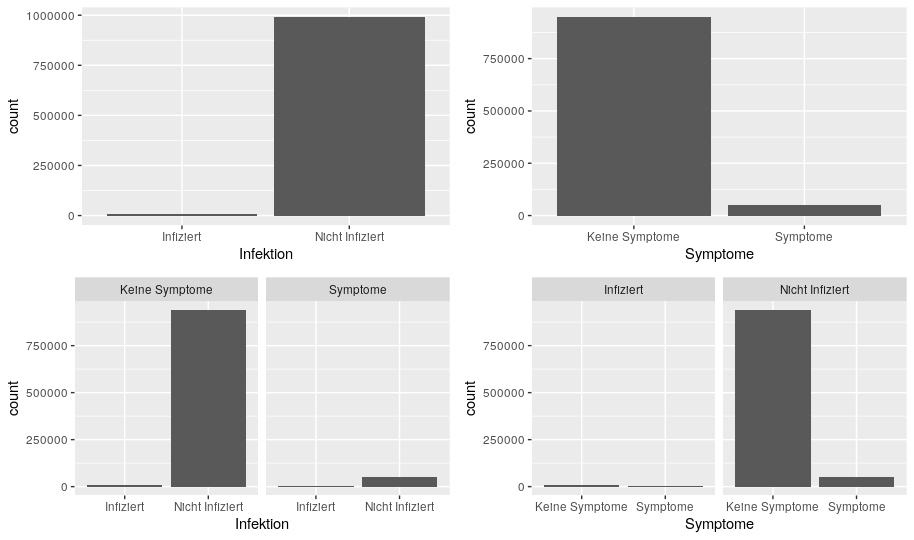
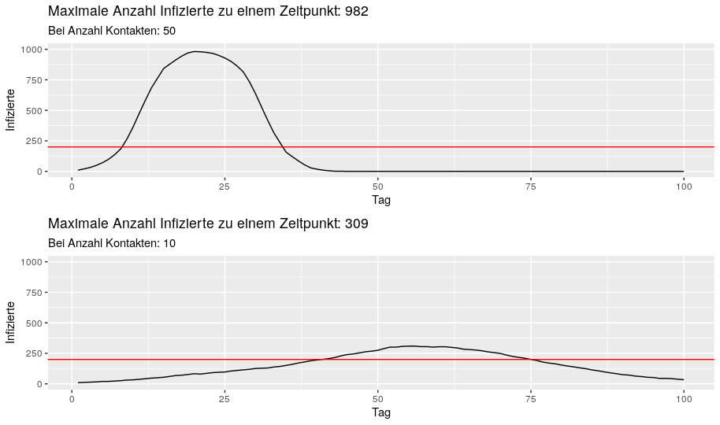

# Data Literacy Simulationen zur Epidemiologie

- Stark vereinfachte Simulationen zum Einsatz in der Lehre.
- Die Modelle sollen keine Realität abbilden sondern **nur** helfen aktuelle Diskussionen innerhalb einer Lehrveranstaltung zu verdeutlichen

## Inhalt

- `SimulationGrundlagen.R`: dient der Verdeutlichung von bedingten und unbedingten Wahrscheinlichkeiten.

- `SimulationEpidemie.R` dient der Verdeutlichung der Auswirkungen von Kontaktreduktionen (Parameter `k`)

## 

Fehler, Hinweise usw. erwünscht!
